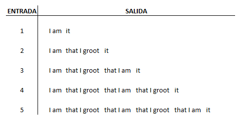
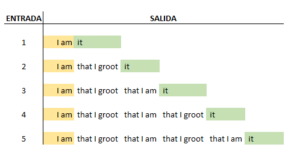
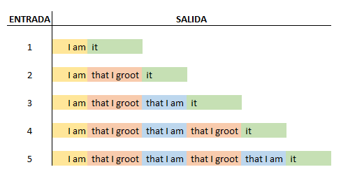

# Ciclo 2<br> Reto semana 1: Entendiendo los sentimientos de Groot

## Enunciado
El lenguaje de Groot es muy complicado para expresar todo lo que quiere decir. 

Los sentimientos tienen n capas:
- Si n = 1, el sentimiento será "I am it", 
- si n = 2 es "I am that I groot it", 
- si n = 3 es "I am that I groot that I am it",
- y así sucesivamente.
**Entrada:** La cantidad n de capas

**Salida:** Muestre la frase que Groot está tratando de decir.

**Ejemplo 1:**
|Entrada |Salida |
|--- | --- |
| 1 | I am it |
| 2 | I am that I groot it |
| 3 | I am that I groot that I am it |
## Solución
 Se utilizó el lenguaje de programación Java para solucionar el ejercicio.
 
 Para comprendender mejor el ejercicio analicé las entradas y salidas del código.



Groot siempre comienza sus frases con "I am" y las termina con "it". Esto es más claro si se resaltan estas partes de la frase.



Ahora, se puede apreciar que Groot incluye los mensajes "that I groot" y "that I am" dentro de sus frase. No obstante, la posición de estos mensajes no es aleatoria, más bien parecieran seguir una secuencia.



Representando las frases de Groot en un `Array` se pueden realizar las siguientes observaciones:
- "I am" se encuentra en la posición cero [0] del arreglo,
- "it" ocupa la última posición del arreglo,
- "that I groot" ocupa las posiciones impares y
- "that I am" está ubicado en las posiciones pares.


Con lo anterior, es posible tener una idea de como resolver este problema, entonces se puede pasar a escribir el código.

En primer lugar, se requiere importar la clase `Scanner`.
``` java
import java.util.Scanner;
```
Ahora, se crea un objeto de tipo `Scanner` que se usará para recibir la entrada del usuario y se utilizará nueva variable para guardar la entrada del usuario..
``` java
public class Reto2 {

    public static void main(String[] args){
        Scanner sc = new Scanner(System.in);
        int n = Integer.parseInt(sc.nextLine());
```
 Notesé que se utiliza el comando `nextLine()` para recibir la entrada como un `String` y se utiliza `Integer.parseInt()` para convertir la entrada en un número entero (`int`). 
 
 Lo anterior se hace porque al recibir entradas con la función `nextInt()` se pueden ocasionar errores. Para más información puede visitar el siguiente [link](https://www.geeksforgeeks.org/why-is-scanner-skipping-nextline-after-use-of-other-next-functions/ "Solucionar error de nextInt").

 Ahora, con ayuda de un arreglo es posible representar la frase de Groot. Recuerde, la frase siempre inicia con "I am" y termina con "it" por lo cuál se asignan estos mensajes a la posición incial [0] del arreglo y a la última posición. También se definen los mensajes "that I am" y "that I groot que ocuparan las posiciones intermedias.
 ``` java
 String[] fraseGroot = new String[(n+1)]; // ¿por qué (n+1)? Leer nota.
        fraseGroot[0] = "I am";
        fraseGroot[n] = " it"; // el espacio se deja para separar los elementos durante la impresión.
        
        String mensajePar = " that I am";
        String mensajeImpar = " that I groot";
```
**Nota:** Se utiliza (n+1) porque los arreglos comienzan en la posición cero (0). Entonces, si se el arreglo se crea de "n" elementos, quedaría faltando un elemento. Para el caso de este ejercicio se vería así:

Ahora, para llenar la frase con los mensajes de la mitad se utilizará un ciclo `for` el cual iniciará en la posición [1] e irá hasta la posición [n]. Recuerde que la posición [0] y [n+1] llevarán los mensajes "I am" e "it" respectivamente.

Para identificar si la posición corresponde a un número par o impar, se utilizará el operador módulo `%` que arroja como resultado el residuo de la división. Recuerde que si un número tiene residuo al dividirlo por dos (2) entonces es impar. Ejemplo: 
- 4%2 = 0, indica que cuatro (4)es par,
- 5%2 = 5, el resultado es diferente de cero (0) entonces 5 es impar (el resultado de esta división es 2.5 y el residuo es 5). 

``` java
for (int i = 1; i < (fraseGroot.length-1); i++) {
    if (i%2 == 0) {
        fraseGroot[i] = mensajePar;
    } else {
        fraseGroot[i] = mensajeImpar;
    }
}
```
Finalmente, para imprimir la frase se utilizará otro ciclo `for` el cual recorrerá todos los elementos y los imprimirá en una única línea.
``` java
for (int i = 0; i < (fraseGroot.length); i++) {
    System.out.print(fraseGroot[i]);
    
}
```

## Créditos
[Jaime Andres Tamayo Cardenas](https://github.com/jtamayoc95 "jtamayoc95")

