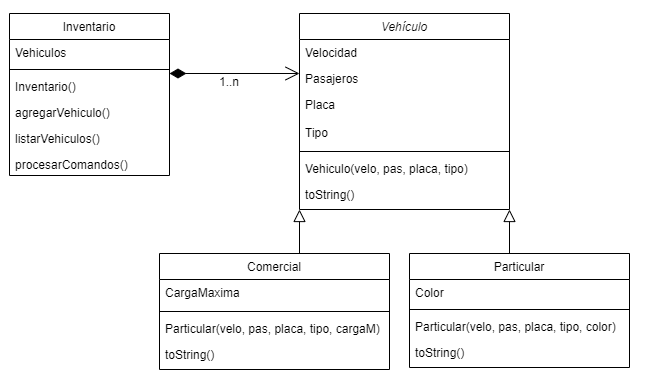

# Ciclo 2  Reto semana 2: Inventario de Vehiculos

## Enunciado
Un gran empresario del gremio automovilístico quiere encomendarle el desarrollo de un pequeño demo de aplicación de tienda de autos. Todos, los Vehículos tienen como atributos velocidad y cantidad de pasajeros y tipo de combustible (diesel, gasolina, híbrido ó eléctrico).

Se tienen dos tipos principales de Vehículo: Comercial que es capaz de transportar una cierta carga límite y particular y uno Particular en la que interesa tener almacenada la información del Color de dicho auto.

 Considere la especificación del siguiente diagrama de clases para este reto:

**Procesar Comandos**

En la clase Inventario, se debe definir la función procesarComandos() que realiza las siguientes operaciones:

**Agregar vehículo:** Opción 1

- Se puede añadir un vehículo de tipo comercial con el siguiente comando: 
    1&Comercial&numeroPasajeros&velocidadMaxima&placa&peso_maximo

    **Ejemplo:**
    1&Comercial&2&150&FFF 222&250

- Se puede añadir un vehículo de tipo particular con el siguiente comando:
    1&Particular&numeroPasajeros&velocidadMaxima&placa&color

    **Ejemplo:**
    1&Particular&8&160&EEE 111&Verde

**Listar ítems del inventario:** Opción 2

Se debe mostrar la frase: “***Inventario de vehículos***” Seguida por los vehículos en el orden en el que fueron agregados.

Si se trata de un vehículo particular se mostrará así. Recuerde que \t implica correr el ítem unos espacios a la derecha:

\tVehiculo Particular - Placa: FFE 000
\tvelocidad: 180 km/h
\tpasajeros: 4
\tcolor: Rojo

 Si se trata de un vehículo comercial se mostrará así:

\tVehiculo Comercial - Placa: FFF 222
\tvelocidad: 150 km/h
\tpasajeros: 2
\tCarga máxima: 250kg

**Salir:** Opción 3

**Nota 1:** Observe que el único comando que tiene salida es el listar.

**Nota 2:** En este ejercicio se requiere subir cuatro archivos. 

- Uno correspondiente a la clase Vehiculo llamado Vehiculo.java,
- otro correspondiente al Vehiculo particular llamado Particular.java,
- otro correspondiente al Vehiculo comercial llamado Comercial.java,
- otro correspondiente al Inventario llamado Inventario.java (Aquí puede colocar el main),
- Recuerde eliminar la línea de package al hacer el envío y utilizar el botón de [+] para agregar más de un archivo de código fuente. 

**Ejemplo:** Un ejemplo de ejecución del programa es el siguiente:
|Entrada |Salida |
| --- | --- |
| 1&Particular&4&180&FFE 000&Rojo  1&Particular&2&240&GOK 223&Azul  1&Particular&8&160&EEE 111&Verde  2&Comercial&2&150&FFF 222&250  2  3  | \*\*\*Inventario de vehículos\*\*\*  Vehículo Particular - Placa: FFE 000  velocidad: 180 km/h  pasajeros: 4  color: Rojo  Vehículo Particular - Placa: GOK 223  velocidad: 240 km/h  pasajeros: 2  color: Azul  Vehículo Particular - Placa: EEE 111  velocidad: 160 km/h  pasajeros: 8  color: Verde  Vehículo Comercial - Placa: FFF 222  velocidad: 150 km/h  pasajeros: 2  Carga máxima: 250kg  |

## Solución

## Créditos
[Jaime Andres Tamayo Cardenas](https://github.com/jtamayoc95 "jtamayoc95")
